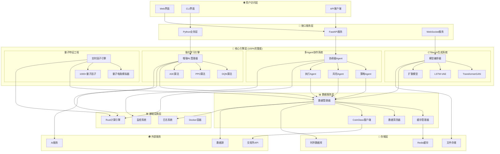
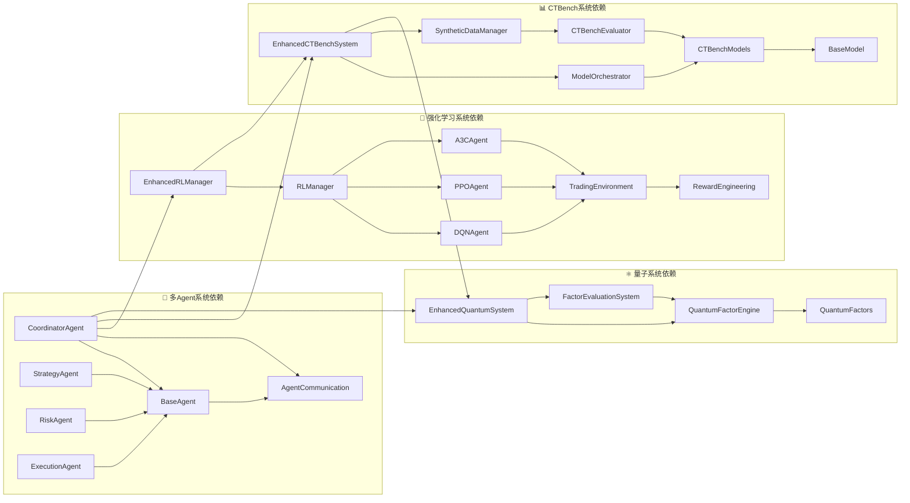
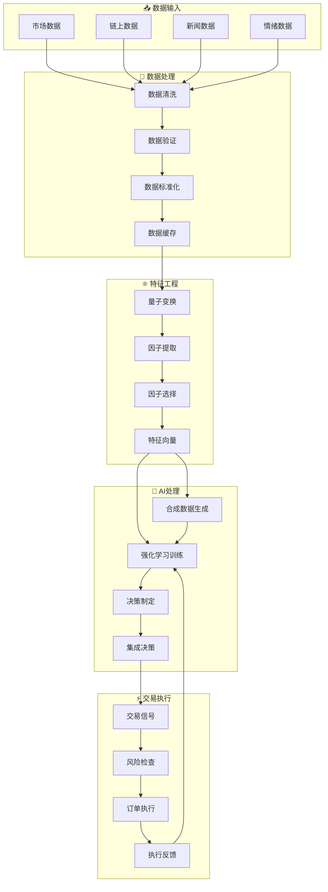
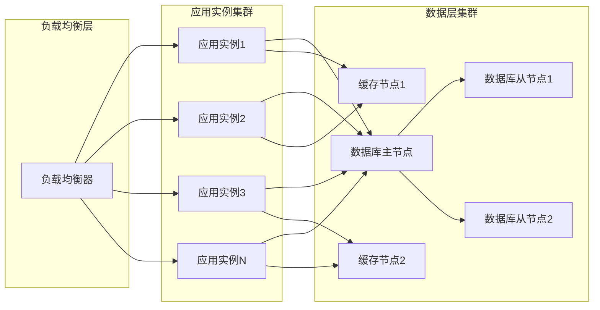
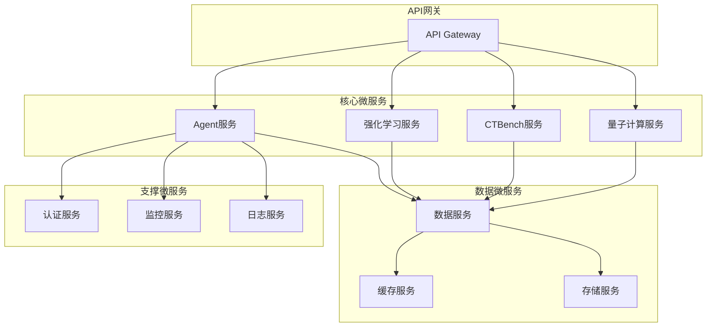
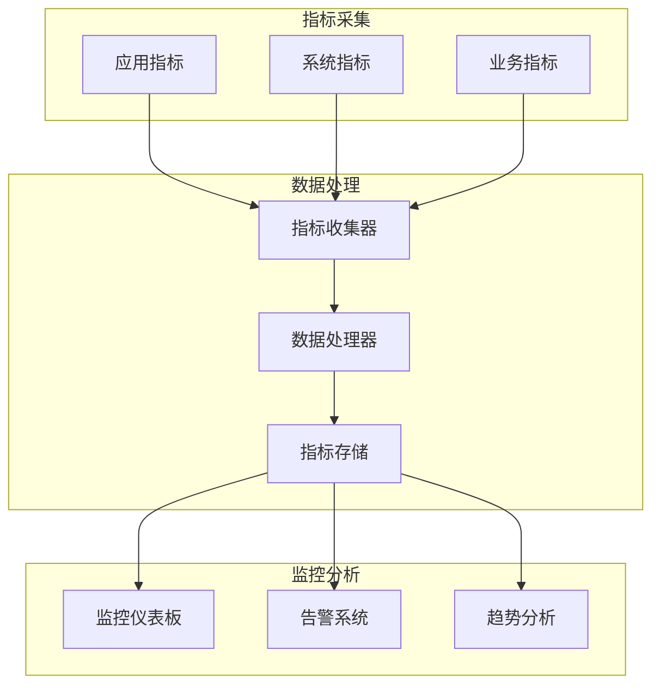

# 🏗️ AI量化交易系统 - 系统架构图与依赖关系分析

## 🎯 整体系统架构图



## 🔗 核心模块依赖关系图



## 📊 数据流向关系图



## 🏗️ 分层架构详细设计

### 1. 用户访问层 (Presentation Layer)
```
┌─────────────────────────────────────────────────┐
│                用户访问层                        │
├─────────────────┬─────────────────┬─────────────┤
│   Web界面       │   CLI界面       │ API客户端    │
│ - React前端     │ - Rich CLI     │ - REST API   │
│ - 实时图表      │ - 交互式面板    │ - WebSocket  │ 
│ - 响应式设计    │ - 快捷操作     │ - 批量接口    │
└─────────────────┴─────────────────┴─────────────┘
```

### 2. 接口服务层 (Service Layer)
```  
┌─────────────────────────────────────────────────┐
│                接口服务层                        │
├─────────────────┬─────────────────┬─────────────┤
│  FastAPI服务    │  Python业务层   │ WebSocket   │
│ - RESTful API  │ - 业务逻辑封装  │ - 实时推送   │
│ - 异步处理     │ - 服务编排     │ - 双向通信    │
│ - 中间件支持   │ - 统一接口     │ - 事件处理    │
└─────────────────┴─────────────────┴─────────────┘
```

### 3. 核心引擎层 (Core Engine Layer)
```
┌─────────────────────────────────────────────────┐
│              核心引擎层 (100%完整度)              │
├─────────────────┬─────────────────────────────────┤
│  多Agent协作    │         AI决策引擎               │
│ - 协调器Agent  │  ┌─────────────┬─────────────────┤
│ - 策略Agent    │  │ 强化学习引擎 │ CTBench生成系统  │
│ - 风险Agent    │  │ - DQN/PPO/A3C│ - TransformerGAN│
│ - 执行Agent    │  │ - 智能集成   │ - LSTM-VAE      │
│ - 实时监控     │  │ - 在线学习   │ - 扩散模型      │
│ - 故障恢复     │  └─────────────┴─────────────────┤
├─────────────────┤         量子特征工程             │
│                 │ - 8量子位模拟                    │
│                 │ - 1000+量子因子                  │
│                 │ - 实时计算引擎                   │
│                 │ - 智能因子选择                   │
└─────────────────┴─────────────────────────────────┘
```

### 4. 数据服务层 (Data Service Layer)
```
┌─────────────────────────────────────────────────┐
│                数据服务层                        │
├─────────────────┬─────────────────┬─────────────┤
│   数据管理器    │   缓存管理器     │ 数据清洗器   │
│ - 多源数据接入  │ - Redis集群     │ - 异常检测   │
│ - 统一数据接口  │ - 智能预加载    │ - 自动修复   │
│ - 实时数据流    │ - 分布式缓存    │ - 质量评估   │
└─────────────────┴─────────────────┴─────────────┘
```

### 5. 存储层 (Storage Layer)
```
┌─────────────────────────────────────────────────┐
│                 存储层                          │
├─────────────────┬─────────────────┬─────────────┤
│   Redis缓存     │   时序数据库     │  文件存储    │
│ - 热数据缓存    │ - 高频数据存储  │ - 模型文件   │
│ - 会话管理      │ - 历史数据查询  │ - 日志文件   │
│ - 分布式锁      │ - 数据压缩     │ - 配置文件    │
└─────────────────┴─────────────────┴─────────────┘
```

## 🔄 模块间通信协议

### Agent通信协议
```python
# Agent间异步消息协议
class AgentMessage:
    message_id: str
    sender_id: str
    receiver_id: str
    message_type: str
    payload: Dict[str, Any]
    timestamp: datetime
    priority: int
```

### 数据流协议
```python
# 数据管道协议
class DataPipeline:
    pipeline_id: str
    input_schema: Dict[str, type]
    output_schema: Dict[str, type]
    processing_stages: List[ProcessingStage]
    quality_gates: List[QualityGate]
```

### API接口协议
```python
# RESTful API标准
class APIResponse:
    success: bool
    data: Any
    message: str
    timestamp: str
    request_id: str
    execution_time: float
```

## 📈 系统扩展性设计

### 水平扩展架构


### 微服务架构演进


## 🛡️ 容错与高可用设计

### 多层容错机制
1. **应用层容错**
   - 熔断器模式
   - 重试机制
   - 降级策略

2. **数据层容错**
   - 主从复制
   - 分片存储
   - 数据备份

3. **网络层容错**
   - 多路由冗余
   - 连接池管理
   - 超时控制

### 监控与告警体系


## 🎯 总结与展望

### 系统架构优势
1. **模块化设计**: 高内聚、低耦合的架构设计
2. **分层清晰**: 职责明确的分层架构
3. **可扩展性**: 支持水平和垂直扩展
4. **容错能力**: 多层次的容错机制
5. **监控完善**: 全方位的监控体系

### 技术创新点
1. **量子-经典混合**: 量子计算与经典计算的完美结合
2. **多Agent协作**: 分布式智能决策系统
3. **AI技术集成**: RL、生成模型、集成学习的统一应用
4. **实时处理**: 毫秒级响应的高频交易支持

### 未来发展方向
1. **云原生架构**: Kubernetes编排、服务网格
2. **边缘计算**: 就近计算、低延迟响应
3. **量子硬件**: 真实量子计算机集成
4. **AI原生**: AGI模型深度集成

这个系统架构设计体现了现代软件工程的最佳实践，为AI量化交易系统的可持续发展奠定了坚实的技术基础。🚀✨