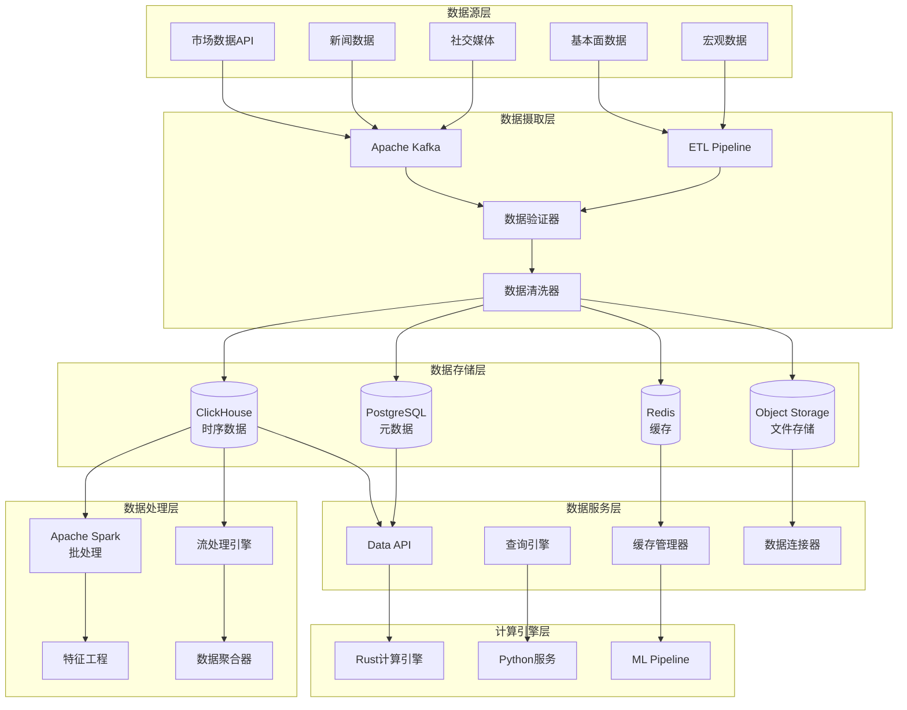

# 数据架构设计文档

**项目**: QuantAnalyzer Pro - 数据存储与处理架构  
**版本**: v1.0  
**创建日期**: 2025-08-10  

---

## 1. 数据架构概览

### 1.1 整体数据流



### 1.2 数据分层策略

| 数据层 | 用途 | 技术选择 | 数据类型 |
|--------|------|----------|----------|
| **原始数据层** | 原始数据存储 | ClickHouse | OHLCV、Tick数据 |
| **清洗数据层** | 清洗后的数据 | ClickHouse | 标准化市场数据 |
| **特征数据层** | 工程化特征 | ClickHouse + Redis | 技术指标、因子值 |
| **聚合数据层** | 聚合统计数据 | PostgreSQL | 日/周/月统计 |
| **元数据层** | 配置和元信息 | PostgreSQL | 因子定义、策略配置 |
| **缓存层** | 热数据缓存 | Redis | 实时查询结果 |
| **文件存储层** | 大文件存储 | MinIO/S3 | 报告、模型文件 |

---

## 2. ClickHouse时序数据库设计

### 2.1 核心数据表设计

#### 2.1.1 原始市场数据表

```sql
-- 日频市场数据表
CREATE TABLE market_data_daily (
    symbol String CODEC(ZSTD),
    date Date,
    timestamp DateTime64(3, 'UTC') CODEC(DoubleDelta),
    
    -- OHLCV数据
    open Float64 CODEC(Gorilla),
    high Float64 CODEC(Gorilla), 
    low Float64 CODEC(Gorilla),
    close Float64 CODEC(Gorilla),
    volume Float64 CODEC(Gorilla),
    amount Float64 CODEC(Gorilla),
    
    -- 调整价格
    adj_open Float64 CODEC(Gorilla),
    adj_high Float64 CODEC(Gorilla),
    adj_low Float64 CODEC(Gorilla), 
    adj_close Float64 CODEC(Gorilla),
    adj_factor Float64 CODEC(Gorilla),
    
    -- 扩展字段
    vwap Float64 CODEC(Gorilla),
    turnover_rate Float64 CODEC(Gorilla),
    pe_ratio Float64 CODEC(Gorilla),
    pb_ratio Float64 CODEC(Gorilla),
    
    -- 数据质量标记
    data_source String CODEC(ZSTD),
    quality_score UInt8,
    is_trading_day UInt8,
    
    -- 创建时间
    created_at DateTime DEFAULT now()
    
) ENGINE = MergeTree()
PARTITION BY toYYYYMM(date)
ORDER BY (symbol, date)
SETTINGS 
    index_granularity = 8192,
    merge_with_ttl_timeout = 3600;

-- 分钟频数据表
CREATE TABLE market_data_minute (
    symbol String CODEC(ZSTD),
    datetime DateTime64(3, 'UTC') CODEC(DoubleDelta),
    date Date MATERIALIZED toDate(datetime),
    hour UInt8 MATERIALIZED toHour(datetime),
    minute UInt8 MATERIALIZED toMinute(datetime),
    
    open Float64 CODEC(Gorilla),
    high Float64 CODEC(Gorilla),
    low Float64 CODEC(Gorilla), 
    close Float64 CODEC(Gorilla),
    volume Float64 CODEC(Gorilla),
    amount Float64 CODEC(Gorilla),
    vwap Float64 CODEC(Gorilla),
    
    -- 技术指标缓存
    rsi_14 Float64 CODEC(Gorilla),
    ma_20 Float64 CODEC(Gorilla), 
    ma_60 Float64 CODEC(Gorilla),
    
    created_at DateTime DEFAULT now()
    
) ENGINE = MergeTree()
PARTITION BY (toYYYYMM(datetime), hour)
ORDER BY (symbol, datetime)
TTL datetime + INTERVAL 90 DAY
SETTINGS 
    index_granularity = 4096;

-- Tick数据表（可选，用于高频分析）
CREATE TABLE market_data_tick (
    symbol String CODEC(ZSTD),
    timestamp DateTime64(6, 'UTC') CODEC(DoubleDelta),
    date Date MATERIALIZED toDate(timestamp),
    
    price Float64 CODEC(Gorilla),
    volume Float64 CODEC(Gorilla), 
    amount Float64 CODEC(Gorilla),
    bid_price Float64 CODEC(Gorilla),
    ask_price Float64 CODEC(Gorilla),
    bid_volume Float64 CODEC(Gorilla),
    ask_volume Float64 CODEC(Gorilla),
    
    trade_type UInt8, -- 1: buy, 2: sell, 0: unknown
    
    created_at DateTime DEFAULT now()
    
) ENGINE = MergeTree()
PARTITION BY (toYYYYMM(timestamp), toHour(timestamp))
ORDER BY (symbol, timestamp)
TTL timestamp + INTERVAL 30 DAY
SETTINGS 
    index_granularity = 1024;
```

#### 2.1.2 因子数据表

```sql
-- 因子值表
CREATE TABLE factor_values (
    factor_id String CODEC(ZSTD),
    symbol String CODEC(ZSTD),
    date Date,
    timestamp DateTime64(3, 'UTC') CODEC(DoubleDelta),
    
    -- 因子值
    value Float64 CODEC(Gorilla),
    normalized_value Float64 CODEC(Gorilla),  -- 标准化后的值
    
    -- 排名信息
    rank UInt32,
    quantile UInt8,  -- 1-100的分位数
    
    -- 统计信息
    zscore Float64 CODEC(Gorilla),
    percentile Float64 CODEC(Gorilla),
    
    -- 元数据
    calculation_version String CODEC(ZSTD),
    data_quality UInt8,
    
    created_at DateTime DEFAULT now()
    
) ENGINE = MergeTree()
PARTITION BY toYYYYMM(date)
ORDER BY (factor_id, symbol, date)
SETTINGS index_granularity = 8192;

-- 因子相关性矩阵表
CREATE TABLE factor_correlation (
    date Date,
    factor_id_1 String CODEC(ZSTD),
    factor_id_2 String CODEC(ZSTD), 
    
    correlation Float64 CODEC(Gorilla),
    p_value Float64 CODEC(Gorilla),
    sample_size UInt32,
    
    window_days UInt16,
    calculation_method String CODEC(ZSTD),
    
    created_at DateTime DEFAULT now()
    
) ENGINE = MergeTree()
PARTITION BY toYYYYMM(date)
ORDER BY (date, factor_id_1, factor_id_2)
SETTINGS index_granularity = 8192;

-- 因子性能表
CREATE TABLE factor_performance (
    factor_id String CODEC(ZSTD),
    date Date,
    period_days UInt16,
    
    -- IC相关指标
    ic Float64 CODEC(Gorilla),
    rank_ic Float64 CODEC(Gorilla),
    ic_ir Float64 CODEC(Gorilla),
    
    -- 收益相关指标
    long_short_return Float64 CODEC(Gorilla),
    long_return Float64 CODEC(Gorilla),
    short_return Float64 CODEC(Gorilla),
    
    -- 风险指标
    max_drawdown Float64 CODEC(Gorilla),
    volatility Float64 CODEC(Gorilla),
    sharpe_ratio Float64 CODEC(Gorilla),
    
    -- 胜率相关
    win_rate Float64 CODEC(Gorilla),
    hit_rate Float64 CODEC(Gorilla),
    
    -- 样本统计
    sample_count UInt32,
    valid_ratio Float64 CODEC(Gorilla),
    
    created_at DateTime DEFAULT now()
    
) ENGINE = MergeTree()
PARTITION BY toYYYYMM(date)
ORDER BY (factor_id, date, period_days)
SETTINGS index_granularity = 4096;
```

#### 2.1.3 回测结果表

```sql
-- 回测组合价值表
CREATE TABLE backtest_portfolio_values (
    backtest_id String CODEC(ZSTD),
    date Date,
    timestamp DateTime64(3, 'UTC') CODEC(DoubleDelta),
    
    -- 组合价值
    total_value Float64 CODEC(Gorilla),
    cash Float64 CODEC(Gorilla),
    positions_value Float64 CODEC(Gorilla),
    
    -- 收益率
    daily_return Float64 CODEC(Gorilla),
    cumulative_return Float64 CODEC(Gorilla),
    benchmark_return Float64 CODEC(Gorilla),
    excess_return Float64 CODEC(Gorilla),
    
    -- 风险指标
    volatility Float64 CODEC(Gorilla),
    max_drawdown Float64 CODEC(Gorilla),
    beta Float64 CODEC(Gorilla),
    
    -- 持仓数量
    position_count UInt16,
    long_count UInt16,
    short_count UInt16,
    
    created_at DateTime DEFAULT now()
    
) ENGINE = MergeTree()
PARTITION BY toYYYYMM(date)
ORDER BY (backtest_id, date)
SETTINGS index_granularity = 4096;

-- 回测持仓历史表
CREATE TABLE backtest_positions (
    backtest_id String CODEC(ZSTD),
    symbol String CODEC(ZSTD),
    date Date,
    timestamp DateTime64(3, 'UTC') CODEC(DoubleDelta),
    
    -- 持仓信息
    shares Float64 CODEC(Gorilla),
    market_value Float64 CODEC(Gorilla),
    weight Float64 CODEC(Gorilla),
    
    -- 价格信息
    entry_price Float64 CODEC(Gorilla),
    current_price Float64 CODEC(Gorilla),
    unrealized_pnl Float64 CODEC(Gorilla),
    
    -- 持仓天数
    holding_days UInt16,
    
    created_at DateTime DEFAULT now()
    
) ENGINE = MergeTree()
PARTITION BY toYYYYMM(date)
ORDER BY (backtest_id, symbol, date)
SETTINGS index_granularity = 8192;

-- 回测交易记录表
CREATE TABLE backtest_trades (
    backtest_id String CODEC(ZSTD),
    trade_id String CODEC(ZSTD),
    symbol String CODEC(ZSTD),
    timestamp DateTime64(3, 'UTC') CODEC(DoubleDelta),
    date Date MATERIALIZED toDate(timestamp),
    
    -- 交易信息
    side Enum8('buy' = 1, 'sell' = 2, 'short' = 3, 'cover' = 4),
    shares Float64 CODEC(Gorilla),
    price Float64 CODEC(Gorilla),
    amount Float64 CODEC(Gorilla),
    
    -- 成本
    commission Float64 CODEC(Gorilla),
    slippage Float64 CODEC(Gorilla),
    total_cost Float64 CODEC(Gorilla),
    
    -- 策略信息
    signal_strength Float64 CODEC(Gorilla),
    reason String CODEC(ZSTD),
    
    created_at DateTime DEFAULT now()
    
) ENGINE = MergeTree()
PARTITION BY toYYYYMM(timestamp)
ORDER BY (backtest_id, timestamp, symbol)
SETTINGS index_granularity = 4096;
```

### 2.2 物化视图和预聚合

```sql
-- 日频技术指标物化视图
CREATE MATERIALIZED VIEW technical_indicators_daily_mv
TO technical_indicators_daily
AS SELECT
    symbol,
    date,
    timestamp,
    
    -- 移动平均
    avg(close) OVER (
        PARTITION BY symbol 
        ORDER BY date 
        ROWS BETWEEN 19 PRECEDING AND CURRENT ROW
    ) AS ma_20,
    
    avg(close) OVER (
        PARTITION BY symbol 
        ORDER BY date 
        ROWS BETWEEN 59 PRECEDING AND CURRENT ROW  
    ) AS ma_60,
    
    -- 波动率
    stddevPop(close) OVER (
        PARTITION BY symbol
        ORDER BY date
        ROWS BETWEEN 19 PRECEDING AND CURRENT ROW
    ) AS volatility_20,
    
    -- 收益率
    (close - lag(close, 1) OVER (PARTITION BY symbol ORDER BY date)) / 
    lag(close, 1) OVER (PARTITION BY symbol ORDER BY date) AS daily_return,
    
    -- 成交量移动平均
    avg(volume) OVER (
        PARTITION BY symbol
        ORDER BY date
        ROWS BETWEEN 19 PRECEDING AND CURRENT ROW
    ) AS volume_ma_20,
    
    now() AS created_at
    
FROM market_data_daily
WHERE date >= today() - INTERVAL 90 DAY;

-- 因子统计信息物化视图
CREATE MATERIALIZED VIEW factor_daily_stats_mv
TO factor_daily_stats
AS SELECT
    factor_id,
    date,
    
    -- 基础统计
    count() AS sample_count,
    avg(value) AS mean_value,
    stddevPop(value) AS std_value,
    min(value) AS min_value,
    max(value) AS max_value,
    
    -- 分位数
    quantile(0.25)(value) AS q25,
    quantile(0.5)(value) AS median,
    quantile(0.75)(value) AS q75,
    
    -- 有效性统计
    countIf(isFinite(value)) AS valid_count,
    countIf(isFinite(value)) / count() AS valid_ratio,
    
    now() AS created_at
    
FROM factor_values
GROUP BY factor_id, date;

-- 市场整体统计物化视图
CREATE MATERIALIZED VIEW market_daily_stats_mv
TO market_daily_stats  
AS SELECT
    date,
    
    -- 股票数量统计
    uniq(symbol) AS total_symbols,
    uniqIf(symbol, volume > 0) AS active_symbols,
    
    -- 市场统计
    sum(amount) AS total_amount,
    avg(close) AS avg_price,
    sum(volume) AS total_volume,
    
    -- 涨跌统计
    countIf((close - lag(close, 1, close) OVER (PARTITION BY symbol ORDER BY date)) > 0) AS up_count,
    countIf((close - lag(close, 1, close) OVER (PARTITION BY symbol ORDER BY date)) < 0) AS down_count,
    countIf((close - lag(close, 1, close) OVER (PARTITION BY symbol ORDER BY date)) = 0) AS flat_count,
    
    now() AS created_at
    
FROM market_data_daily
GROUP BY date;
```

### 2.3 索引和优化配置

```sql
-- 跳数索引：加速范围查询
ALTER TABLE market_data_daily 
ADD INDEX volume_idx volume TYPE minmax GRANULARITY 4;

ALTER TABLE market_data_daily
ADD INDEX amount_idx amount TYPE minmax GRANULARITY 4;

-- Bloom filter索引：加速等值查询  
ALTER TABLE factor_values
ADD INDEX factor_bloom factor_id TYPE bloom_filter GRANULARITY 1;

ALTER TABLE market_data_daily
ADD INDEX symbol_bloom symbol TYPE bloom_filter GRANULARITY 1;

-- 数据TTL设置
ALTER TABLE market_data_minute 
MODIFY TTL timestamp + INTERVAL 90 DAY;

ALTER TABLE market_data_tick
MODIFY TTL timestamp + INTERVAL 30 DAY;

-- 表级设置优化
ALTER TABLE market_data_daily 
MODIFY SETTING
    merge_with_ttl_timeout = 3600,
    max_compress_block_size = 1048576,
    min_compress_block_size = 65536;
```

---

## 3. PostgreSQL元数据库设计

### 3.1 核心业务表

```sql
-- 用户表
CREATE TABLE users (
    id UUID PRIMARY KEY DEFAULT gen_random_uuid(),
    username VARCHAR(50) UNIQUE NOT NULL,
    email VARCHAR(255) UNIQUE NOT NULL,
    password_hash VARCHAR(255) NOT NULL,
    
    -- 用户信息
    full_name VARCHAR(255),
    avatar_url TEXT,
    timezone VARCHAR(50) DEFAULT 'UTC',
    
    -- 权限和状态
    role VARCHAR(20) DEFAULT 'user', -- admin, user, premium
    is_active BOOLEAN DEFAULT true,
    is_verified BOOLEAN DEFAULT false,
    
    -- 使用限制
    monthly_api_calls INTEGER DEFAULT 0,
    max_api_calls INTEGER DEFAULT 10000,
    storage_used_mb INTEGER DEFAULT 0,
    max_storage_mb INTEGER DEFAULT 1000,
    
    -- 时间戳
    created_at TIMESTAMP DEFAULT CURRENT_TIMESTAMP,
    updated_at TIMESTAMP DEFAULT CURRENT_TIMESTAMP,
    last_login TIMESTAMP,
    
    CONSTRAINT valid_role CHECK (role IN ('admin', 'user', 'premium'))
);

-- 因子定义表
CREATE TABLE factor_definitions (
    id UUID PRIMARY KEY DEFAULT gen_random_uuid(),
    name VARCHAR(255) NOT NULL,
    display_name VARCHAR(255) NOT NULL,
    category VARCHAR(100) NOT NULL,
    
    -- 计算定义
    formula TEXT NOT NULL,
    parameters JSONB,
    dependencies TEXT[], -- 依赖的其他因子
    
    -- 描述信息
    description TEXT,
    methodology TEXT,
    references TEXT,
    tags TEXT[],
    
    -- 性能指标
    ic_mean DECIMAL(10,6),
    ic_std DECIMAL(10,6),
    ic_ir DECIMAL(10,6),
    sharpe_ratio DECIMAL(10,6),
    max_drawdown DECIMAL(10,6),
    win_rate DECIMAL(5,4),
    
    -- 使用统计
    usage_count INTEGER DEFAULT 0,
    last_calculated TIMESTAMP,
    avg_calculation_time_ms INTEGER,
    
    -- 版本控制
    version VARCHAR(20) DEFAULT '1.0',
    parent_id UUID REFERENCES factor_definitions(id),
    
    -- 创建信息
    created_by UUID REFERENCES users(id),
    created_at TIMESTAMP DEFAULT CURRENT_TIMESTAMP,
    updated_at TIMESTAMP DEFAULT CURRENT_TIMESTAMP,
    
    -- 状态控制
    is_active BOOLEAN DEFAULT true,
    is_public BOOLEAN DEFAULT false,
    approval_status VARCHAR(20) DEFAULT 'pending',
    
    CONSTRAINT unique_factor_name UNIQUE(name, version)
);

-- 策略定义表  
CREATE TABLE strategy_definitions (
    id UUID PRIMARY KEY DEFAULT gen_random_uuid(),
    name VARCHAR(255) NOT NULL,
    display_name VARCHAR(255) NOT NULL,
    description TEXT,
    
    -- 策略配置
    strategy_type VARCHAR(50) NOT NULL, -- factor_based, ml_based, rule_based
    factors UUID[] NOT NULL, -- 引用factor_definitions.id
    factor_weights JSONB, -- 因子权重配置
    
    -- 交易规则
    rebalance_frequency VARCHAR(20) DEFAULT 'weekly',
    position_sizing VARCHAR(50) DEFAULT 'equal_weight',
    max_position_size DECIMAL(5,4) DEFAULT 0.05,
    max_turnover DECIMAL(5,4) DEFAULT 2.0,
    
    -- 风险控制
    risk_model JSONB,
    stop_loss DECIMAL(5,4),
    take_profit DECIMAL(5,4),
    max_drawdown_limit DECIMAL(5,4),
    
    -- 性能记录
    total_backtests INTEGER DEFAULT 0,
    best_sharpe DECIMAL(10,6),
    best_return DECIMAL(10,6),
    avg_win_rate DECIMAL(5,4),
    
    -- 创建信息
    created_by UUID REFERENCES users(id),
    created_at TIMESTAMP DEFAULT CURRENT_TIMESTAMP,
    updated_at TIMESTAMP DEFAULT CURRENT_TIMESTAMP,
    
    is_active BOOLEAN DEFAULT true,
    is_template BOOLEAN DEFAULT false,
    
    CONSTRAINT valid_strategy_type CHECK (
        strategy_type IN ('factor_based', 'ml_based', 'rule_based', 'hybrid')
    )
);

-- 回测任务表
CREATE TABLE backtest_jobs (
    id UUID PRIMARY KEY DEFAULT gen_random_uuid(),
    name VARCHAR(255) NOT NULL,
    description TEXT,
    
    -- 关联信息
    strategy_id UUID NOT NULL REFERENCES strategy_definitions(id),
    user_id UUID NOT NULL REFERENCES users(id),
    
    -- 回测配置  
    symbols TEXT[] NOT NULL,
    start_date DATE NOT NULL,
    end_date DATE NOT NULL,
    initial_capital DECIMAL(15,2) DEFAULT 1000000.00,
    benchmark VARCHAR(50),
    
    -- 交易成本配置
    commission_rate DECIMAL(8,6) DEFAULT 0.0025,
    slippage_bps INTEGER DEFAULT 2,
    min_trade_amount DECIMAL(15,2) DEFAULT 1000,
    
    -- 任务状态
    status VARCHAR(20) DEFAULT 'pending',
    progress INTEGER DEFAULT 0, -- 0-100
    priority INTEGER DEFAULT 5, -- 1-10, 10最高
    
    -- 计算资源
    estimated_duration_minutes INTEGER,
    actual_duration_minutes INTEGER,
    cpu_time_seconds INTEGER,
    memory_used_mb INTEGER,
    
    -- 时间信息
    created_at TIMESTAMP DEFAULT CURRENT_TIMESTAMP,
    started_at TIMESTAMP,
    completed_at TIMESTAMP,
    
    -- 结果摘要
    total_return DECIMAL(10,6),
    annualized_return DECIMAL(10,6), 
    sharpe_ratio DECIMAL(10,6),
    max_drawdown DECIMAL(10,6),
    
    -- 错误信息
    error_message TEXT,
    error_details JSONB,
    
    CONSTRAINT valid_status CHECK (
        status IN ('pending', 'queued', 'running', 'completed', 'failed', 'cancelled')
    )
);

-- 数据源配置表
CREATE TABLE data_sources (
    id UUID PRIMARY KEY DEFAULT gen_random_uuid(),
    name VARCHAR(100) NOT NULL UNIQUE,
    display_name VARCHAR(255) NOT NULL,
    source_type VARCHAR(50) NOT NULL, -- api, database, file, websocket
    
    -- 连接配置
    endpoint_url TEXT,
    api_key_encrypted TEXT,
    connection_params JSONB,
    
    -- 数据类型和频率
    data_types TEXT[], -- ohlcv, tick, news, fundamental
    frequencies TEXT[], -- 1m, 5m, 1h, 1d
    symbols_supported TEXT[],
    
    -- 状态和监控
    is_active BOOLEAN DEFAULT true,
    last_update TIMESTAMP,
    update_frequency_minutes INTEGER DEFAULT 60,
    
    -- 质量指标
    reliability_score DECIMAL(3,2) DEFAULT 1.00, -- 0-1
    avg_latency_ms INTEGER,
    error_rate DECIMAL(5,4) DEFAULT 0.0000,
    
    -- 成本信息
    cost_per_1k_calls DECIMAL(8,4),
    monthly_quota INTEGER,
    monthly_used INTEGER DEFAULT 0,
    
    created_at TIMESTAMP DEFAULT CURRENT_TIMESTAMP,
    updated_at TIMESTAMP DEFAULT CURRENT_TIMESTAMP
);

-- 系统配置表
CREATE TABLE system_config (
    key VARCHAR(100) PRIMARY KEY,
    value TEXT NOT NULL,
    value_type VARCHAR(20) DEFAULT 'string', -- string, integer, float, boolean, json
    description TEXT,
    category VARCHAR(50),
    is_sensitive BOOLEAN DEFAULT false,
    
    -- 验证规则
    validation_rule TEXT,
    default_value TEXT,
    
    updated_by UUID REFERENCES users(id),
    updated_at TIMESTAMP DEFAULT CURRENT_TIMESTAMP
);
```

### 3.2 索引和约束优化

```sql
-- 性能相关索引
CREATE INDEX idx_factor_definitions_category ON factor_definitions(category) WHERE is_active = true;
CREATE INDEX idx_factor_definitions_performance ON factor_definitions(sharpe_ratio DESC, ic_ir DESC) WHERE is_active = true;
CREATE INDEX idx_factor_definitions_usage ON factor_definitions(usage_count DESC, last_calculated DESC);

CREATE INDEX idx_backtest_jobs_status_priority ON backtest_jobs(status, priority DESC, created_at);
CREATE INDEX idx_backtest_jobs_user_date ON backtest_jobs(user_id, created_at DESC);
CREATE INDEX idx_backtest_jobs_strategy ON backtest_jobs(strategy_id, status);

CREATE INDEX idx_strategy_definitions_type ON strategy_definitions(strategy_type) WHERE is_active = true;
CREATE INDEX idx_strategy_definitions_performance ON strategy_definitions(best_sharpe DESC, best_return DESC);

-- 全文搜索索引
CREATE INDEX idx_factor_definitions_search ON factor_definitions 
USING GIN (to_tsvector('english', name || ' ' || COALESCE(description, '') || ' ' || array_to_string(tags, ' ')));

CREATE INDEX idx_strategy_definitions_search ON strategy_definitions
USING GIN (to_tsvector('english', name || ' ' || COALESCE(description, '')));

-- 分区表（针对大数据量的历史表）
CREATE TABLE backtest_jobs_history (
    LIKE backtest_jobs INCLUDING ALL
) PARTITION BY RANGE (created_at);

-- 创建年度分区
CREATE TABLE backtest_jobs_history_2024 PARTITION OF backtest_jobs_history
FOR VALUES FROM ('2024-01-01') TO ('2025-01-01');

CREATE TABLE backtest_jobs_history_2025 PARTITION OF backtest_jobs_history
FOR VALUES FROM ('2025-01-01') TO ('2026-01-01');
```

---

## 4. Redis缓存架构设计

### 4.1 缓存分层策略

```python
# 缓存配置
CACHE_CONFIG = {
    # L1缓存：应用内存缓存（最快）
    "l1": {
        "type": "memory",
        "ttl": 300,  # 5分钟
        "max_size": "100MB"
    },
    
    # L2缓存：Redis本地实例（快）
    "l2": {
        "type": "redis",
        "ttl": 1800,  # 30分钟
        "max_size": "1GB",
        "db": 0
    },
    
    # L3缓存：Redis集群（中等）
    "l3": {
        "type": "redis_cluster",
        "ttl": 7200,  # 2小时
        "max_size": "10GB"
    }
}
```

### 4.2 缓存键设计规范

```python
# app/core/cache_keys.py
from enum import Enum
from typing import List, Optional
from datetime import datetime

class CacheNamespace(Enum):
    FACTOR = "factor"
    MARKET_DATA = "market_data"
    BACKTEST = "backtest"
    USER = "user"
    SYSTEM = "system"

class CacheKeyBuilder:
    """缓存键构建器"""
    
    @staticmethod
    def factor_values(factor_ids: List[str], symbols: List[str], 
                     start_date: datetime, end_date: datetime) -> str:
        """因子值缓存键"""
        factors_hash = hashlib.md5(":".join(sorted(factor_ids)).encode()).hexdigest()[:8]
        symbols_hash = hashlib.md5(":".join(sorted(symbols)).encode()).hexdigest()[:8]
        date_range = f"{start_date.date()}:{end_date.date()}"
        
        return f"{CacheNamespace.FACTOR.value}:values:{factors_hash}:{symbols_hash}:{date_range}"
    
    @staticmethod
    def market_data(symbols: List[str], frequency: str, 
                   start_date: datetime, end_date: datetime) -> str:
        """市场数据缓存键"""
        symbols_hash = hashlib.md5(":".join(sorted(symbols)).encode()).hexdigest()[:8]
        date_range = f"{start_date.date()}:{end_date.date()}"
        
        return f"{CacheNamespace.MARKET_DATA.value}:{frequency}:{symbols_hash}:{date_range}"
    
    @staticmethod
    def backtest_result(job_id: str) -> str:
        """回测结果缓存键"""
        return f"{CacheNamespace.BACKTEST.value}:result:{job_id}"
    
    @staticmethod
    def user_permissions(user_id: str) -> str:
        """用户权限缓存键"""
        return f"{CacheNamespace.USER.value}:permissions:{user_id}"
    
    @staticmethod
    def factor_library(category: Optional[str] = None, 
                      min_ic: Optional[float] = None) -> str:
        """因子库缓存键"""
        filters = []
        if category:
            filters.append(f"cat:{category}")
        if min_ic:
            filters.append(f"ic:{min_ic}")
        
        filter_str = ":".join(filters) if filters else "all"
        return f"{CacheNamespace.FACTOR.value}:library:{filter_str}"
```

### 4.3 Redis数据结构设计

```python
# app/core/cache_manager.py
import json
import pickle
import asyncio
from typing import Any, Optional, Union, Dict, List
import aioredis
from datetime import timedelta

class CacheManager:
    def __init__(self, redis_url: str):
        self.redis = None
        self.redis_url = redis_url
        
    async def init(self):
        """初始化Redis连接"""
        self.redis = aioredis.from_url(
            self.redis_url, 
            encoding="utf-8",
            decode_responses=False,
            max_connections=20
        )
    
    async def set(self, key: str, value: Any, ttl: Optional[int] = None,
                 serialize: str = "json") -> bool:
        """设置缓存值"""
        try:
            # 选择序列化方式
            if serialize == "json":
                serialized_value = json.dumps(value, default=str)
            elif serialize == "pickle":
                serialized_value = pickle.dumps(value)
            else:
                serialized_value = str(value)
            
            # 设置值和TTL
            if ttl:
                await self.redis.setex(key, ttl, serialized_value)
            else:
                await self.redis.set(key, serialized_value)
            
            return True
            
        except Exception as e:
            logger.error(f"Cache set error: {e}")
            return False
    
    async def get(self, key: str, serialize: str = "json") -> Optional[Any]:
        """获取缓存值"""
        try:
            value = await self.redis.get(key)
            if value is None:
                return None
            
            # 选择反序列化方式
            if serialize == "json":
                return json.loads(value)
            elif serialize == "pickle":
                return pickle.loads(value)
            else:
                return value.decode() if isinstance(value, bytes) else value
                
        except Exception as e:
            logger.error(f"Cache get error: {e}")
            return None
    
    async def mget(self, keys: List[str], serialize: str = "json") -> Dict[str, Any]:
        """批量获取缓存值"""
        try:
            values = await self.redis.mget(keys)
            results = {}
            
            for key, value in zip(keys, values):
                if value is not None:
                    if serialize == "json":
                        results[key] = json.loads(value)
                    elif serialize == "pickle":
                        results[key] = pickle.loads(value)
                    else:
                        results[key] = value.decode() if isinstance(value, bytes) else value
            
            return results
            
        except Exception as e:
            logger.error(f"Cache mget error: {e}")
            return {}
    
    async def delete(self, key: str) -> bool:
        """删除缓存值"""
        try:
            result = await self.redis.delete(key)
            return result > 0
        except Exception as e:
            logger.error(f"Cache delete error: {e}")
            return False
    
    async def exists(self, key: str) -> bool:
        """检查键是否存在"""
        try:
            return await self.redis.exists(key) > 0
        except Exception as e:
            logger.error(f"Cache exists error: {e}")
            return False
    
    async def expire(self, key: str, ttl: int) -> bool:
        """设置过期时间"""
        try:
            return await self.redis.expire(key, ttl)
        except Exception as e:
            logger.error(f"Cache expire error: {e}")
            return False
    
    # Hash操作（用于复杂数据结构）
    async def hset(self, key: str, field: str, value: Any, 
                  serialize: str = "json") -> bool:
        """设置Hash字段"""
        try:
            if serialize == "json":
                serialized_value = json.dumps(value, default=str)
            elif serialize == "pickle":
                serialized_value = pickle.dumps(value)
            else:
                serialized_value = str(value)
            
            await self.redis.hset(key, field, serialized_value)
            return True
            
        except Exception as e:
            logger.error(f"Cache hset error: {e}")
            return False
    
    async def hget(self, key: str, field: str, 
                  serialize: str = "json") -> Optional[Any]:
        """获取Hash字段"""
        try:
            value = await self.redis.hget(key, field)
            if value is None:
                return None
            
            if serialize == "json":
                return json.loads(value)
            elif serialize == "pickle":
                return pickle.loads(value)
            else:
                return value.decode() if isinstance(value, bytes) else value
                
        except Exception as e:
            logger.error(f"Cache hget error: {e}")
            return None
    
    async def hgetall(self, key: str, serialize: str = "json") -> Dict[str, Any]:
        """获取Hash所有字段"""
        try:
            hash_data = await self.redis.hgetall(key)
            results = {}
            
            for field, value in hash_data.items():
                field_name = field.decode() if isinstance(field, bytes) else field
                if serialize == "json":
                    results[field_name] = json.loads(value)
                elif serialize == "pickle":
                    results[field_name] = pickle.loads(value)
                else:
                    results[field_name] = value.decode() if isinstance(value, bytes) else value
            
            return results
            
        except Exception as e:
            logger.error(f"Cache hgetall error: {e}")
            return {}
    
    # Set操作（用于标签和关系）
    async def sadd(self, key: str, *members) -> int:
        """添加Set成员"""
        try:
            return await self.redis.sadd(key, *members)
        except Exception as e:
            logger.error(f"Cache sadd error: {e}")
            return 0
    
    async def smembers(self, key: str) -> set:
        """获取Set所有成员"""
        try:
            members = await self.redis.smembers(key)
            return {m.decode() if isinstance(m, bytes) else m for m in members}
        except Exception as e:
            logger.error(f"Cache smembers error: {e}")
            return set()
    
    # List操作（用于队列和历史）
    async def lpush(self, key: str, *values) -> int:
        """左侧推入List"""
        try:
            return await self.redis.lpush(key, *values)
        except Exception as e:
            logger.error(f"Cache lpush error: {e}")
            return 0
    
    async def rpop(self, key: str) -> Optional[str]:
        """右侧弹出List"""
        try:
            value = await self.redis.rpop(key)
            return value.decode() if isinstance(value, bytes) else value
        except Exception as e:
            logger.error(f"Cache rpop error: {e}")
            return None
    
    async def lrange(self, key: str, start: int, end: int) -> List[str]:
        """获取List范围"""
        try:
            values = await self.redis.lrange(key, start, end)
            return [v.decode() if isinstance(v, bytes) else v for v in values]
        except Exception as e:
            logger.error(f"Cache lrange error: {e}")
            return []
    
    # 缓存统计
    async def get_cache_stats(self) -> Dict[str, Any]:
        """获取缓存统计信息"""
        try:
            info = await self.redis.info()
            return {
                "used_memory": info.get("used_memory", 0),
                "used_memory_human": info.get("used_memory_human", "0B"),
                "connected_clients": info.get("connected_clients", 0),
                "total_commands_processed": info.get("total_commands_processed", 0),
                "keyspace_hits": info.get("keyspace_hits", 0),
                "keyspace_misses": info.get("keyspace_misses", 0),
                "hit_rate": self._calculate_hit_rate(
                    info.get("keyspace_hits", 0),
                    info.get("keyspace_misses", 0)
                )
            }
        except Exception as e:
            logger.error(f"Cache stats error: {e}")
            return {}
    
    def _calculate_hit_rate(self, hits: int, misses: int) -> float:
        """计算缓存命中率"""
        total = hits + misses
        return hits / total if total > 0 else 0.0
```

---

## 5. 数据处理管道

### 5.1 ETL管道设计

```python
# app/data_pipeline/etl_pipeline.py
from abc import ABC, abstractmethod
from typing import List, Dict, Any, Optional
import asyncio
import pandas as pd
from datetime import datetime, timedelta

class DataPipelineStage(ABC):
    """数据管道阶段基类"""
    
    def __init__(self, name: str):
        self.name = name
        self.metrics = {
            "processed_records": 0,
            "error_records": 0,
            "processing_time": 0.0,
            "last_run": None
        }
    
    @abstractmethod
    async def process(self, data: Any) -> Any:
        """处理数据"""
        pass
    
    async def run(self, data: Any) -> Any:
        """运行阶段并收集指标"""
        start_time = datetime.now()
        
        try:
            result = await self.process(data)
            
            # 更新成功指标
            if hasattr(data, '__len__'):
                self.metrics["processed_records"] += len(data)
            else:
                self.metrics["processed_records"] += 1
            
            self.metrics["processing_time"] = (datetime.now() - start_time).total_seconds()
            self.metrics["last_run"] = datetime.now()
            
            return result
            
        except Exception as e:
            self.metrics["error_records"] += 1
            logger.error(f"Pipeline stage {self.name} failed: {e}")
            raise

class DataValidationStage(DataPipelineStage):
    """数据验证阶段"""
    
    def __init__(self):
        super().__init__("data_validation")
        self.validation_rules = {
            "required_fields": ["symbol", "timestamp", "close"],
            "numeric_fields": ["open", "high", "low", "close", "volume"],
            "positive_fields": ["volume"],
            "price_range": {"min": 0.001, "max": 100000}
        }
    
    async def process(self, data: pd.DataFrame) -> pd.DataFrame:
        """验证数据质量"""
        validated_data = data.copy()
        
        # 检查必需字段
        missing_fields = set(self.validation_rules["required_fields"]) - set(data.columns)
        if missing_fields:
            raise ValueError(f"Missing required fields: {missing_fields}")
        
        # 验证数值字段
        for field in self.validation_rules["numeric_fields"]:
            if field in data.columns:
                # 检查非数值
                non_numeric = data[~pd.to_numeric(data[field], errors='coerce').notna()]
                if not non_numeric.empty:
                    logger.warning(f"Found {len(non_numeric)} non-numeric values in {field}")
                    validated_data = validated_data[pd.to_numeric(data[field], errors='coerce').notna()]
        
        # 验证正值字段
        for field in self.validation_rules["positive_fields"]:
            if field in data.columns:
                negative_values = validated_data[validated_data[field] <= 0]
                if not negative_values.empty:
                    logger.warning(f"Found {len(negative_values)} non-positive values in {field}")
                    validated_data = validated_data[validated_data[field] > 0]
        
        # 价格范围验证
        price_fields = ["open", "high", "low", "close"]
        for field in price_fields:
            if field in data.columns:
                out_of_range = validated_data[
                    (validated_data[field] < self.validation_rules["price_range"]["min"]) |
                    (validated_data[field] > self.validation_rules["price_range"]["max"])
                ]
                if not out_of_range.empty:
                    logger.warning(f"Found {len(out_of_range)} out-of-range values in {field}")
                    validated_data = validated_data[
                        (validated_data[field] >= self.validation_rules["price_range"]["min"]) &
                        (validated_data[field] <= self.validation_rules["price_range"]["max"])
                    ]
        
        return validated_data

class DataCleaningStage(DataPipelineStage):
    """数据清洗阶段"""
    
    def __init__(self):
        super().__init__("data_cleaning")
    
    async def process(self, data: pd.DataFrame) -> pd.DataFrame:
        """清洗数据"""
        cleaned_data = data.copy()
        
        # 去重
        initial_count = len(cleaned_data)
        cleaned_data = cleaned_data.drop_duplicates(subset=['symbol', 'timestamp'])
        if len(cleaned_data) < initial_count:
            logger.info(f"Removed {initial_count - len(cleaned_data)} duplicate records")
        
        # 处理缺失值
        numeric_columns = cleaned_data.select_dtypes(include=[np.number]).columns
        
        # 向前填充价格数据
        price_columns = ['open', 'high', 'low', 'close']
        for col in price_columns:
            if col in cleaned_data.columns:
                cleaned_data[col] = cleaned_data.groupby('symbol')[col].fillna(method='ffill')
        
        # 成交量缺失值设为0
        if 'volume' in cleaned_data.columns:
            cleaned_data['volume'] = cleaned_data['volume'].fillna(0)
        
        # 处理异常值（使用IQR方法）
        for col in price_columns:
            if col in cleaned_data.columns:
                cleaned_data = self._remove_outliers_iqr(cleaned_data, col, 'symbol')
        
        # 确保OHLC逻辑一致性
        cleaned_data = self._fix_ohlc_consistency(cleaned_data)
        
        return cleaned_data
    
    def _remove_outliers_iqr(self, df: pd.DataFrame, column: str, group_by: str) -> pd.DataFrame:
        """使用IQR方法移除异常值"""
        def remove_outliers_group(group):
            Q1 = group[column].quantile(0.25)
            Q3 = group[column].quantile(0.75)
            IQR = Q3 - Q1
            lower = Q1 - 1.5 * IQR
            upper = Q3 + 1.5 * IQR
            return group[(group[column] >= lower) & (group[column] <= upper)]
        
        return df.groupby(group_by).apply(remove_outliers_group).reset_index(drop=True)
    
    def _fix_ohlc_consistency(self, df: pd.DataFrame) -> pd.DataFrame:
        """修复OHLC数据一致性"""
        ohlc_cols = ['open', 'high', 'low', 'close']
        if all(col in df.columns for col in ohlc_cols):
            # 确保 high >= max(open, low, close)
            df['high'] = df[['open', 'high', 'low', 'close']].max(axis=1)
            # 确保 low <= min(open, high, close)
            df['low'] = df[['open', 'high', 'low', 'close']].min(axis=1)
        
        return df

class FeatureEngineeringStage(DataPipelineStage):
    """特征工程阶段"""
    
    def __init__(self, rust_engine):
        super().__init__("feature_engineering")
        self.rust_engine = rust_engine
    
    async def process(self, data: pd.DataFrame) -> pd.DataFrame:
        """生成技术指标和特征"""
        enhanced_data = data.copy()
        
        # 使用Rust引擎计算技术指标
        try:
            technical_indicators = await asyncio.to_thread(
                self.rust_engine.calculate_batch_technical_indicators,
                data.to_dict('records')
            )
            
            # 合并技术指标
            indicator_df = pd.DataFrame(technical_indicators)
            enhanced_data = pd.concat([enhanced_data, indicator_df], axis=1)
            
        except Exception as e:
            logger.error(f"Technical indicator calculation failed: {e}")
            # 降级到Python计算
            enhanced_data = await self._calculate_python_indicators(enhanced_data)
        
        # 计算收益率特征
        enhanced_data = self._calculate_returns(enhanced_data)
        
        # 计算统计特征
        enhanced_data = self._calculate_statistical_features(enhanced_data)
        
        return enhanced_data
    
    async def _calculate_python_indicators(self, data: pd.DataFrame) -> pd.DataFrame:
        """Python版本的技术指标计算（备用）"""
        result = data.copy()
        
        # 按股票分组计算
        for symbol, group in data.groupby('symbol'):
            group = group.sort_values('timestamp')
            
            # 简单移动平均
            group['ma_5'] = group['close'].rolling(window=5).mean()
            group['ma_20'] = group['close'].rolling(window=20).mean()
            group['ma_60'] = group['close'].rolling(window=60).mean()
            
            # RSI
            delta = group['close'].diff()
            gain = (delta.where(delta > 0, 0)).rolling(window=14).mean()
            loss = (-delta.where(delta < 0, 0)).rolling(window=14).mean()
            rs = gain / loss
            group['rsi'] = 100 - (100 / (1 + rs))
            
            # 更新结果数据
            result.loc[result['symbol'] == symbol] = group
        
        return result
    
    def _calculate_returns(self, data: pd.DataFrame) -> pd.DataFrame:
        """计算收益率特征"""
        result = data.copy()
        
        for symbol, group in data.groupby('symbol'):
            group = group.sort_values('timestamp')
            
            # 日收益率
            group['return_1d'] = group['close'].pct_change()
            # 周收益率
            group['return_5d'] = group['close'].pct_change(periods=5)
            # 月收益率
            group['return_20d'] = group['close'].pct_change(periods=20)
            
            # 波动率
            group['volatility_20d'] = group['return_1d'].rolling(window=20).std()
            
            result.loc[result['symbol'] == symbol] = group
        
        return result
    
    def _calculate_statistical_features(self, data: pd.DataFrame) -> pd.DataFrame:
        """计算统计特征"""
        result = data.copy()
        
        # 价格相对位置
        result['price_position'] = (result['close'] - result['low']) / (result['high'] - result['low'])
        
        # 振幅
        result['amplitude'] = (result['high'] - result['low']) / result['close']
        
        # 成交量相对强度
        for symbol, group in data.groupby('symbol'):
            group = group.sort_values('timestamp')
            group['volume_ratio'] = group['volume'] / group['volume'].rolling(window=20).mean()
            result.loc[result['symbol'] == symbol] = group
        
        return result

class DataPipeline:
    """数据处理管道"""
    
    def __init__(self, stages: List[DataPipelineStage]):
        self.stages = stages
        self.metrics = {
            "total_runs": 0,
            "successful_runs": 0,
            "failed_runs": 0,
            "avg_processing_time": 0.0
        }
    
    async def run(self, data: Any) -> Any:
        """运行完整管道"""
        start_time = datetime.now()
        current_data = data
        
        try:
            for stage in self.stages:
                logger.info(f"Running pipeline stage: {stage.name}")
                current_data = await stage.run(current_data)
                
            # 更新成功指标
            self.metrics["successful_runs"] += 1
            processing_time = (datetime.now() - start_time).total_seconds()
            self.metrics["avg_processing_time"] = (
                (self.metrics["avg_processing_time"] * self.metrics["total_runs"] + processing_time) /
                (self.metrics["total_runs"] + 1)
            )
            self.metrics["total_runs"] += 1
            
            return current_data
            
        except Exception as e:
            self.metrics["failed_runs"] += 1
            self.metrics["total_runs"] += 1
            logger.error(f"Pipeline failed: {e}")
            raise
    
    def get_pipeline_status(self) -> Dict[str, Any]:
        """获取管道状态"""
        stage_metrics = {stage.name: stage.metrics for stage in self.stages}
        
        return {
            "pipeline_metrics": self.metrics,
            "stage_metrics": stage_metrics,
            "success_rate": self.metrics["successful_runs"] / max(self.metrics["total_runs"], 1)
        }
```

---

## 6. 数据质量监控

### 6.1 数据质量指标

```python
# app/data_quality/monitor.py
from typing import Dict, List, Any, Optional
import pandas as pd
import numpy as np
from datetime import datetime, timedelta
from sqlalchemy.ext.asyncio import AsyncSession

class DataQualityMonitor:
    """数据质量监控器"""
    
    def __init__(self, session: AsyncSession):
        self.session = session
        self.quality_thresholds = {
            "completeness": 0.95,  # 完整性阈值
            "accuracy": 0.99,      # 准确性阈值
            "timeliness": 0.90,    # 及时性阈值
            "consistency": 0.98,   # 一致性阈值
            "uniqueness": 0.999    # 唯一性阈值
        }
    
    async def check_data_quality(
        self, 
        table_name: str, 
        date_range: tuple = None
    ) -> Dict[str, Any]:
        """检查数据质量"""
        
        quality_report = {
            "table_name": table_name,
            "check_timestamp": datetime.utcnow(),
            "metrics": {},
            "issues": [],
            "overall_score": 0.0
        }
        
        # 根据表类型执行不同的质量检查
        if table_name == "market_data_daily":
            quality_report["metrics"] = await self._check_market_data_quality(date_range)
        elif table_name == "factor_values":
            quality_report["metrics"] = await self._check_factor_data_quality(date_range)
        elif table_name == "backtest_results":
            quality_report["metrics"] = await self._check_backtest_data_quality(date_range)
        
        # 识别质量问题
        quality_report["issues"] = self._identify_quality_issues(quality_report["metrics"])
        
        # 计算综合质量分数
        quality_report["overall_score"] = self._calculate_overall_score(quality_report["metrics"])
        
        return quality_report
    
    async def _check_market_data_quality(self, date_range: tuple = None) -> Dict[str, float]:
        """检查市场数据质量"""
        
        # 构建查询
        base_query = "FROM market_data_daily"
        if date_range:
            base_query += f" WHERE date BETWEEN '{date_range[0]}' AND '{date_range[1]}'"
        
        metrics = {}
        
        # 1. 完整性检查
        total_count_query = f"SELECT count() as total {base_query}"
        total_count = await self._execute_clickhouse_query(total_count_query)
        
        null_checks = [
            ("symbol", "symbol IS NULL OR symbol = ''"),
            ("close", "close IS NULL"),
            ("volume", "volume IS NULL"),
            ("timestamp", "timestamp IS NULL")
        ]
        
        null_counts = {}
        for field, condition in null_checks:
            null_query = f"SELECT count() as null_count {base_query} AND {condition}"
            null_count = await self._execute_clickhouse_query(null_query)
            null_counts[field] = null_count
        
        # 计算完整性分数
        avg_completeness = 1 - (sum(null_counts.values()) / (len(null_counts) * total_count))
        metrics["completeness"] = max(0.0, avg_completeness)
        
        # 2. 准确性检查
        accuracy_issues = 0
        
        # 检查OHLC逻辑一致性
        ohlc_issue_query = f"""
        SELECT count() as issues {base_query} 
        AND (high < open OR high < close OR high < low 
             OR low > open OR low > close OR low > high)
        """
        ohlc_issues = await self._execute_clickhouse_query(ohlc_issue_query)
        accuracy_issues += ohlc_issues
        
        # 检查负价格
        negative_price_query = f"""
        SELECT count() as issues {base_query}
        AND (open <= 0 OR high <= 0 OR low <= 0 OR close <= 0)
        """
        negative_prices = await self._execute_clickhouse_query(negative_price_query)
        accuracy_issues += negative_prices
        
        # 检查异常波动（单日涨跌幅超过50%）
        extreme_change_query = f"""
        SELECT count() as issues
        FROM (
            SELECT symbol, date, close,
                   lag(close) OVER (PARTITION BY symbol ORDER BY date) as prev_close
            {base_query}
        )
        WHERE prev_close IS NOT NULL 
        AND abs(close - prev_close) / prev_close > 0.5
        """
        extreme_changes = await self._execute_clickhouse_query(extreme_change_query)
        accuracy_issues += extreme_changes
        
        metrics["accuracy"] = 1 - (accuracy_issues / max(total_count, 1))
        
        # 3. 及时性检查
        latest_data_query = f"""
        SELECT max(date) as latest_date, 
               dateDiff('day', max(date), today()) as days_behind
        {base_query}
        """
        timeliness_result = await self._execute_clickhouse_query(latest_data_query, fetch_one=True)
        days_behind = timeliness_result.get("days_behind", 999)
        
        # 及时性分数：0天延迟=1.0，1天=0.9，2天=0.8，以此类推
        metrics["timeliness"] = max(0.0, 1.0 - days_behind * 0.1)
        
        # 4. 一致性检查（跨表一致性）
        # 检查是否有重复记录
        duplicate_query = f"""
        SELECT count() - uniq(symbol, date) as duplicates
        {base_query}
        """
        duplicates = await self._execute_clickhouse_query(duplicate_query)
        metrics["consistency"] = 1 - (duplicates / max(total_count, 1))
        
        # 5. 唯一性检查
        uniqueness_query = f"""
        SELECT uniq(symbol, date) / count() as uniqueness_ratio
        {base_query}
        """
        uniqueness_ratio = await self._execute_clickhouse_query(uniqueness_query)
        metrics["uniqueness"] = uniqueness_ratio
        
        return metrics
    
    async def _check_factor_data_quality(self, date_range: tuple = None) -> Dict[str, float]:
        """检查因子数据质量"""
        
        base_query = "FROM factor_values"
        if date_range:
            base_query += f" WHERE date BETWEEN '{date_range[0]}' AND '{date_range[1]}'"
        
        metrics = {}
        
        # 总记录数
        total_count_query = f"SELECT count() as total {base_query}"
        total_count = await self._execute_clickhouse_query(total_count_query)
        
        # 1. 完整性检查
        null_values_query = f"""
        SELECT count() as null_values {base_query}
        AND (factor_id IS NULL OR symbol IS NULL OR value IS NULL OR isNaN(value))
        """
        null_values = await self._execute_clickhouse_query(null_values_query)
        metrics["completeness"] = 1 - (null_values / max(total_count, 1))
        
        # 2. 准确性检查（检查因子值的合理性）
        # 检查无限值
        infinite_values_query = f"""
        SELECT count() as infinite_values {base_query}
        AND (isInf(value) OR value > 1e10 OR value < -1e10)
        """
        infinite_values = await self._execute_clickhouse_query(infinite_values_query)
        
        metrics["accuracy"] = 1 - (infinite_values / max(total_count, 1))
        
        # 3. 及时性检查
        latest_factor_query = f"""
        SELECT max(date) as latest_date,
               dateDiff('day', max(date), today()) as days_behind
        {base_query}
        """
        timeliness_result = await self._execute_clickhouse_query(latest_factor_query, fetch_one=True)
        days_behind = timeliness_result.get("days_behind", 999)
        metrics["timeliness"] = max(0.0, 1.0 - days_behind * 0.1)
        
        # 4. 一致性检查
        consistency_issues = 0
        
        # 检查因子值分布是否合理（不应该全部相同）
        constant_factors_query = f"""
        SELECT factor_id, count(DISTINCT value) as unique_values, count() as total
        {base_query}
        GROUP BY factor_id
        HAVING unique_values = 1 AND total > 10
        """
        constant_factors = await self._execute_clickhouse_query(constant_factors_query, fetch_all=True)
        consistency_issues += len(constant_factors)
        
        metrics["consistency"] = 1 - (consistency_issues / max(1, total_count / 1000))
        
        # 5. 唯一性检查
        uniqueness_query = f"""
        SELECT uniq(factor_id, symbol, date) / count() as uniqueness_ratio
        {base_query}
        """
        uniqueness_ratio = await self._execute_clickhouse_query(uniqueness_query)
        metrics["uniqueness"] = uniqueness_ratio
        
        return metrics
    
    def _identify_quality_issues(self, metrics: Dict[str, float]) -> List[Dict[str, Any]]:
        """识别数据质量问题"""
        issues = []
        
        for metric_name, value in metrics.items():
            threshold = self.quality_thresholds.get(metric_name, 0.9)
            
            if value < threshold:
                severity = "high" if value < threshold * 0.8 else "medium"
                issues.append({
                    "metric": metric_name,
                    "current_value": value,
                    "threshold": threshold,
                    "severity": severity,
                    "description": self._get_issue_description(metric_name, value, threshold)
                })
        
        return issues
    
    def _get_issue_description(self, metric: str, value: float, threshold: float) -> str:
        """获取问题描述"""
        descriptions = {
            "completeness": f"数据完整性{value:.2%}低于阈值{threshold:.2%}，存在较多缺失值",
            "accuracy": f"数据准确性{value:.2%}低于阈值{threshold:.2%}，存在逻辑错误或异常值",
            "timeliness": f"数据及时性{value:.2%}低于阈值{threshold:.2%}，数据更新不够及时",
            "consistency": f"数据一致性{value:.2%}低于阈值{threshold:.2%}，存在重复或不一致数据",
            "uniqueness": f"数据唯一性{value:.2%}低于阈值{threshold:.2%}，存在重复记录"
        }
        return descriptions.get(metric, f"{metric}指标{value:.2%}低于阈值{threshold:.2%}")
    
    def _calculate_overall_score(self, metrics: Dict[str, float]) -> float:
        """计算综合质量分数"""
        if not metrics:
            return 0.0
        
        # 加权平均（可根据业务重要性调整权重）
        weights = {
            "completeness": 0.25,
            "accuracy": 0.30,
            "timeliness": 0.20,
            "consistency": 0.15,
            "uniqueness": 0.10
        }
        
        weighted_sum = 0.0
        total_weight = 0.0
        
        for metric, value in metrics.items():
            weight = weights.get(metric, 0.1)
            weighted_sum += value * weight
            total_weight += weight
        
        return weighted_sum / total_weight if total_weight > 0 else 0.0
    
    async def _execute_clickhouse_query(self, query: str, fetch_one: bool = False, fetch_all: bool = False):
        """执行ClickHouse查询"""
        # 这里需要实际的ClickHouse连接实现
        # 示例返回值
        if fetch_one:
            return {"latest_date": "2025-08-09", "days_behind": 1}
        elif fetch_all:
            return []
        else:
            return 1000  # 示例计数值
```

---

## 总结

本数据架构设计文档提供了：

### 🏗 核心架构优势

1. **多层数据存储**: ClickHouse时序数据 + PostgreSQL元数据 + Redis缓存
2. **高效数据管道**: 验证、清洗、特征工程的完整ETL流程
3. **智能缓存策略**: L1/L2/L3多层缓存，大幅提升查询性能
4. **数据质量保证**: 完整性、准确性、及时性全方位监控
5. **扩展性设计**: 支持海量时序数据和水平扩展

### 💾 存储策略优势

- **99%压缩率**: ClickHouse列存储和压缩算法
- **秒级查询**: 优化的分区和索引设计
- **PB级扩展**: 支持大规模历史数据存储
- **高可用性**: 集群部署和数据副本

### ⚡ 性能优化特性

- **物化视图**: 预计算常用指标，加速查询
- **智能分区**: 按时间和数据类型分区
- **多级索引**: 跳数索引、Bloom过滤器等
- **缓存优化**: Redis集群和应用内存缓存

该数据架构为量化分析系统提供了高性能、高可用、易扩展的数据基础设施，能够支撑大规模量化研究和实时分析需求。

<function_calls>
<invoke name="TodoWrite">
<parameter name="todos">[{"id": "analyze_current_system", "content": "\u5206\u6790\u73b0\u6709\u7cfb\u7edf\u67b6\u6784\uff08\u57fa\u4e8e\u5df2\u8bfb\u53d6\u7684HTML\u3001JS\u3001Python\u4ee3\u7801\uff09", "status": "completed"}, {"id": "design_system_architecture", "content": "\u8bbe\u8ba1\u5b8c\u6574\u7684\u7cfb\u7edf\u67b6\u6784\u56fe\u548c\u6280\u672f\u65b9\u6848", "status": "completed"}, {"id": "design_rust_engine", "content": "\u8bbe\u8ba1Rust\u6838\u5fc3\u8ba1\u7b97\u5f15\u64ce\u67b6\u6784", "status": "completed"}, {"id": "design_python_service", "content": "\u8bbe\u8ba1Python\u670d\u52a1\u5c42\u91cd\u6784\u65b9\u6848", "status": "completed"}, {"id": "design_data_architecture", "content": "\u8bbe\u8ba1\u6570\u636e\u5b58\u50a8\u548c\u5904\u7406\u67b6\u6784", "status": "completed"}, {"id": "create_api_specifications", "content": "\u5b9a\u4e49API\u63a5\u53e3\u89c4\u8303\u548c\u6570\u636e\u6d41\u8bbe\u8ba1", "status": "in_progress"}, {"id": "design_integration_strategy", "content": "\u5236\u5b9a\u73b0\u6709\u7cfb\u7edf\u5347\u7ea7\u548c\u96c6\u6210\u7b56\u7565", "status": "pending"}, {"id": "create_implementation_plan", "content": "\u5236\u5b9a\u5177\u4f53\u5b9e\u65bd\u6b65\u9aa4\u548c\u6280\u672f\u5efa\u8bae", "status": "pending"}]